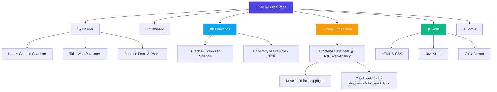

# 📄 My Resume — Simple Web Resume Page

<div align="center">


**A clean, single-page HTML resume — showcasing the professional profile of *Gautam Chauhan*.**

</div>

---

## 📸 Preview

<div align="center">

</div>

---

## ✨ Overview

This is a lightweight **static HTML resume page** built with semantic markup. It presents:

- 🧑‍💼 Name, title & contact details
- 📝 A professional summary
- 🎓 Education background
- 💼 Work experience with achievements
- 🛠️ Technical skills
- © Footer with copyright

No frameworks, no dependencies — just pure, semantic **HTML5**.

---

## 🗂️ Page Structure (Flowchart)



---

## 🧱 Tech Stack

| Technology | Purpose |
|------------|---------|
| **HTML5**  | Page structure & semantic markup |

---

## 📁 File Structure

```
📦 my-resume
 ┣ 📜 index.html          → Main HTML file
 ┣ 🖼️ resume_preview.png   → Screenshot of the page
 ┗ 📄 README.md            → You are here!
```

---

## 🚀 Getting Started

1. **Clone or download** this repository
   ```bash
   git clone https://github.com/your-username/my-resume.git
   ```
2. **Open the file** — no build step needed
   ```bash
   cd my-resume
   open index.html   # or double-click the file
   ```
3. That's it — the resume renders entirely in your browser! 🎉

---

## 🧩 Sections Breakdown

| Section | Tag(s) | Description |
|---|---|---|
| **Header** | `<header>` | Name, job title, email & phone |
| **Summary** | `<section>` | One-line professional overview |
| **Education** | `<section>` | Degree, university & graduation year |
| **Work Experience** | `<section>` + `<ul>` | Role, company, duration & key contributions |
| **Skills** | `<section>` + `<ul>` | Core technical skills |
| **Footer** | `<footer>` | Copyright notice |

---

## 🔮 Future Improvements

- [ ] Add CSS styling for a polished, professional layout
- [ ] Make the page responsive for mobile & tablet
- [ ] Add a downloadable PDF version button
- [ ] Add icons next to contact details and skills
- [ ] Add a "Projects" section with links
- [ ] Add print-friendly styles for physical resumes

---

## 📬 Contact

| | |
|---|---|
| 📧 **Email** | Gautam.chauhan@example.com |
| 📞 **Phone** | (123) 456-789 |

---

<div align="center">

Made with ❤️ by **Gautam Chauhan**

</div>
